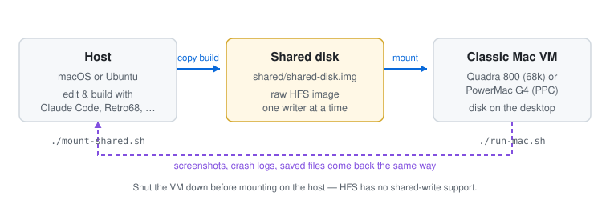
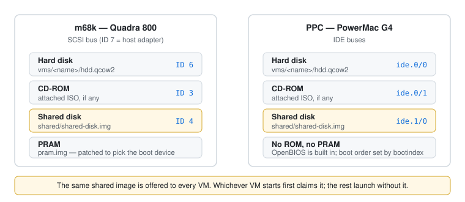

# QemuMac

Run classic Macintosh VMs under QEMU — 68k (Quadra 800) and PowerPC (PowerMac G4) —
on macOS or Ubuntu, with a shared disk for moving files between host and guest.

## Why

Partly to run old software. Mostly to close the loop on **classic Mac development**:
build on the host with modern tools, drop the artifact on the shared disk, and run it
under real Mac OS 7/8/9/X a few seconds later. The same disk is the general way to get
files on and off the VMs, in either direction.



That is why the shared disk is central rather than a convenience feature.

## Requirements

- QEMU 8.2 or later with `m68k` and `ppc` targets — `run-mac.sh` checks and refuses
  to launch on anything older. Newer is better; nothing here caps the version.
- `jq`, `curl`, `unzip`
- `hfsutils` (macOS) or `hfsprogs` (Ubuntu) — only for mounting the shared disk on the host
- `lsof` or `fuser` — used to stop two writers touching the shared disk at once

`./install-deps.sh` installs all of it and finishes with a feature check. It offers two
routes: your package manager, or a source build of the **latest stable QEMU release**.
On macOS the fast route is already the newest — Homebrew tracks QEMU closely. On Linux,
apt gives you whatever your Ubuntu release froze on, so the source build is how you get
current.

Ubuntu 24.04 (QEMU 8.2), Ubuntu 26.04 and a from-source build of the latest release are
all tested in CI on every push, booting real 68k and PPC guests.

## Quick start

```bash
./install-deps.sh     # once
./run-mac.sh          # interactive menu: pick a VM, optionally attach an ISO
```

Five VMs ship ready to use. On first boot each one downloads its installer and boots
from it; after that they boot from their hard disk.

| VM | OS | Arch |
|---|---|---|
| `68k_quadra_800` | Mac OS 7.6.1 | m68k |
| `68k_quadra_800_os753` | Mac OS 7.5.3 | m68k |
| `power_mac_g4_os9` | Mac OS 9.2.2 | ppc |
| `power_mac_g4_tiger` | Mac OS X 10.4 Tiger | ppc |
| `power_mac_g4_leopard` | Mac OS X 10.5.6 Leopard | ppc |

## The dev loop

The shared disk is a raw HFS image every VM can mount. Format it once from inside a
VM (Erase Disk → Mac OS Standard), then:

```bash
./run-mac.sh --config vms/68k_quadra_800/68k_quadra_800.conf   # format it, then shut down

./mount-shared.sh                 # mount on the host
cp build/MyApp /tmp/qemu-shared/  # Linux: a real mount point
./mount-shared.sh -u              # release before starting a VM
```

On macOS there is no HFS write support in the kernel, so `mount-shared.sh` uses
`hfsutils` instead of a mount point:

```bash
./mount-shared.sh          # hmount the image
hcopy build/MyApp :        # copy to the disk
hls                        # list
./mount-shared.sh -u       # humount
```

It works just as well in the other direction, and for anything at all — not only
build artifacts. Every VM mounts the same disk, so it is the general way to move
files on and off a guest: drop documents, fonts, System extensions or disk images
in from the host, and copy screenshots, saved games or a finished project back out.
It also moves files *between* VMs — mount it in the Quadra, copy something over,
shut down, boot the G4.

**Resource forks.** Classic Mac files carry a data fork *and* a resource fork, and a
plain `cp` or `hcopy` copies only the data. Applications, and anything with icons or
custom resources, arrive broken. Move them as a single-fork archive instead — `.sit`,
`.hqx`, `.bin` (MacBinary) or a disk image — and unpack inside the guest with StuffIt
Expander. `hcopy -m` writes MacBinary, `hcopy -b` BinHex. Plain data files (text,
source, JPEGs) copy fine as-is.

**Only one writer at a time.** HFS has no shared-write support — the guest caches
volume metadata, so a host write underneath it corrupts the catalog. `mount-shared.sh`
refuses to mount a disk a VM has open, and `run-mac.sh` launches without the shared
disk if something else already holds it.

Point a VM at its own disk with `SHARED_DISK` in its config; pass the same value to
the mounter:

```bash
SHARED_DISK=vms/my-vm/shared.img ./mount-shared.sh
```

## Downloading software

```bash
./iso-downloader.sh
```

Installers, ROMs and applications from a curated database, checksum-verified. Entries
marked `"delivery": "shared"` are written straight to the shared disk. Add your own
sources in `iso/custom-software.json` (same schema as `iso/software-database.json`);
it is merged over the defaults.

## Creating a VM

```bash
./run-mac.sh --create-config my_mac
```

Prompts for architecture, an optional default installer, and a description for the
menu. Writes `vms/my_mac/my_mac.conf` with a unique MAC address.

## Configuration reference

VM configs are plain bash. Everything except `ARCH` and `HD_IMAGE` has a default.

| Variable | Default | Meaning |
|---|---|---|
| `ARCH` | — | `m68k` or `ppc` |
| `MACHINE_TYPE` | — | `q800` or `mac99` |
| `RAM_SIZE` / `HD_SIZE` | `128M`/`2G` (m68k), `512M`/`10G` (ppc) | Memory, and disk size at creation |
| `HD_IMAGE` | — | Path to the qcow2 disk |
| `PRAM_FILE` | — | m68k only; stores the boot device |
| `HD_SCSI_ID` / `CD_SCSI_ID` / `SHARED_SCSI_ID` | `6` / `3` / `4` | m68k only; 7 is the host adapter |
| `MAC_ADDRESS` | — | Must be unique per VM (Apple OUI `08:00:07:…`) |
| `DEFAULT_INSTALLER` | — | Database key downloaded and booted on first run |
| `DESCRIPTION` | — | Shown in the launcher menu |
| `SHARED_DISK` | `shared/shared-disk.img` | Per-VM shared disk |
| `SHARED_DISK_SIZE` | `512M` | Size at creation |
| `DISPLAY_RES` | `1152x870x8` (m68k), `1024x768x32` (ppc) | Resolution and colour depth |
| `DISPLAY_ZOOM` | `true` | Resizable window that scales the guest (macOS only) |
| `DISPLAY_SMOOTH` | `false` | Interpolated rather than nearest-neighbour scaling (macOS only) |
| `DISPLAY_FULLSCREEN` | `false` | Start full screen |
| `AUDIO_BACKEND` | auto | `coreaudio` on macOS; PipeWire/Pulse, ALSA or `none` on Linux |

## Display

**Window too small?** Just resize it — with `DISPLAY_ZOOM=true` (the default) the guest
scales to fill the window. This is the usual fix on a Retina Mac, where QEMU renders one
guest pixel per *physical* pixel, so 1152×870 lands in a window about half that size.

**Want a physically larger Mac OS UI?** Lower the resolution. The Quadra framebuffer
accepts a fixed set of modes:

```
640x480   depth 1, 2, 4, 8, 24
800x600   depth 1, 2, 4, 8, 24
1152x870  depth 1, 2, 4, 8          ← no 24-bit at this resolution
```

`DISPLAY_RES="800x600x24"` gives a chunkier UI *and* millions of colours instead of 256.
QEMU lists the valid modes if you pick an invalid one.

PPC guests can change resolution themselves once booted; `DISPLAY_RES` only sets the
initial mode.

On Linux the SDL window is resizable and scales on its own, so `DISPLAY_ZOOM` is a no-op
there. `DISPLAY_SMOOTH` needs QEMU 9.0; on an older build it is dropped and scaling stays
nearest-neighbour.

**No sound, or a crash on a headless machine?** QEMU defaults to ALSA on Linux, and on
a host with no sound card the Quadra's Apple Sound Chip fails to initialise and QEMU
segfaults. A backend is therefore always chosen explicitly — set `AUDIO_BACKEND="none"`
to force silence, or name a driver your build supports.

## Storage layout



Boot device selection differs by architecture: m68k patches a SCSI RefNum into the PRAM
file, PPC passes `bootindex` to QEMU.

## Installing an OS manually

```bash
./run-mac.sh --config vms/my_mac/my_mac.conf --iso "iso/Apple Legacy Recovery.iso" --boot-from-cd
```

Format the hard drive from the installer, install, then boot without `--boot-from-cd`.

**Leopard needs an extra pass.** Let the install run to completion — it reports
"installation failed", which is expected. Choose the hard drive as the startup disk. It
reboots from the CD again; close the window at the language screen. Relaunch and it boots
from disk.

**Tip:** copy Disk Copy 6.3.3 off the Apple Legacy Recovery disc onto your hard drive.
It is the tool for mounting disk images inside classic Mac OS.

## Tests

```bash
./tests/run-tests.sh            # everything
./tests/run-tests.sh display    # filter by suite name
```

The suite asserts on behaviour, not on the text of the scripts: it puts a stub
`qemu-system-*` on `PATH` that prints its own argv, runs the real `run-mac.sh`, and
checks the command line that comes out. It also covers GNU/BSD portability, bash 3.2
syntax, both display branches, shared-disk locking, and first-run recovery. It needs no
network. CI runs it on Ubuntu 24.04, Ubuntu 26.04 and macOS.

Stubs only prove the launcher builds the right command. These use real QEMU, and can be
run by hand on a matching host:

```bash
./tests/ci/linux-integration.sh    # apt install, boot 68k and PPC, guest really draws
./tests/ci/linux-shared-disk.sh    # format, mount and deliver onto a real HFS+ volume
./tests/ci/macos-integration.sh    # brew install, framebuffer modes, real QEMU features
./tests/ci/linux-source-build.sh   # build QEMU from source, launch with it
```

They skip cleanly on the wrong OS. The source build runs weekly and on demand rather
than on every push, since it takes tens of minutes.

To run the same checks before pushing:

```bash
git config core.hooksPath .githooks
```

## Troubleshooting

**Mouse is trapped (Linux).** Right-Ctrl + G.

**"Shared disk is in use".** Another VM has it, or it is mounted on the host. Shut the VM
down, or run `./mount-shared.sh -u`.

**First boot did not download the installer.** Downloads that fail leave no disk image
behind, so the next run retries. If the VM boots to a blank drive, delete its
`hdd.qcow2` and run again.

**Checksum mismatch.** The upstream archive changed. Verify the source, then update the
`md5` in `iso/software-database.json`.

## Layout

```
run-mac.sh          launcher and VM runner
iso-downloader.sh   software/ROM downloader
mount-shared.sh     host access to the shared disk
install-deps.sh     QEMU and dependency installer
lib/common.sh       shared shell library
tests/              behavioural test suite
vms/                VM configs and disk images
iso/  roms/         media and ROMs (gitignored)
shared/             the shared disk (gitignored)
```
